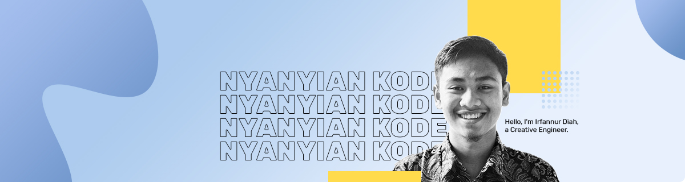

<br>  

# Hi! There  
[](https://git.io/typing-svg)
<!--  -->

<!---
[](https://twitter.com/irfnrdh)  &nbsp;&nbsp;&nbsp;&nbsp;
[](https://www.linkedin.com/id/irfnrdh/)
-->


<h6 align="center">
  
   <br>
  <a href="https://irfnrdh.gumroad.com/">Store</a> • <a href="https://www.paypal.me/irfnrdh">Donate</a> • <a href="https://irfnrdh.substack.com">Newsletter</a></h6>
  

```js
export default () => ({
  notionUrl: "https://kodekeras.my.id/",
  askMeAbout: [
    "life", "idea"
  ],
  technologies: {
    "I just learn everything on the trendline since 2008"
  },
  skills: [
    "thinker", "architect"
  ],
  interest: [
    "Technology", "Programming", "Reading", "Serial Entrepreneur"
    "Writing", "Psychology", "Philosophy", "agent of change"
  ],
  simpleThing:[
    "Part time artist, full time creator",
    "Learn. Create. Develop. Share"
  ]
});
```

<br>

### 🌱 I’m currently learning to build [Ruema](https://ruema.xyz) since covid-19 start March 2020
### 💬 Ask me anything about life & idea
### 📧 Reach me: **irfnrdh@gmail.com**
### 👾 Check out dailynotes on [Twitter](https://twitter.com/irfnrdh/)
### 💻 Visit Bad website [🌐](http://irfnrdh.github.io/) / [🌐](http://kodekeras.my.id/)
<br>


<!-- 
<p align="center">  </p>  <br>

<p float="right">  </p> 

<p align="center">  </p>

## Connect with me:

<br>
<a href="http://kodekeras.my.id" target="_blank"></a>
<a href="https://twitter.com/irfnrdh" target="_blank"></a>
<a href="https://www.linkedin.com/in/irfnrdh/" target="_blank"></a>
<a href="https://www.instagram.com/irfnrdh/" target="_blank"></a>

<br>
<br>


---

  

---

  
-->
<!--
Part time artist, full time creator
[Learn. Create. Develop. Share]

|||
|---|---|
||| 


### Hi there 👋

Yooo! !

**irfnrdh/irfnrdh** is a ✨ _special_ ✨ repository because its `README.md` (this file) appears on your GitHub profile.

Here are some ideas to get you started:

- 🔭 I’m currently working on ...
- 🌱 I’m currently learning ...
- 👯 I’m looking to collaborate on ...
- 🤔 I’m looking for help with ...
- 💬 Ask me about ...
- 📫 How to reach me: ...
- 😄 Pronouns: ...
- ⚡ Fun fact: ...
-->


<!-- <audio controls autoplay loop>
  <source src="https://cloud-b5knydoz5-hack-club-bot.vercel.app/0imagine_dragons_-_all_eyes__audio_.mp3" type="audio/mpeg">
Your browser does not support the audio element.
</audio> -->
